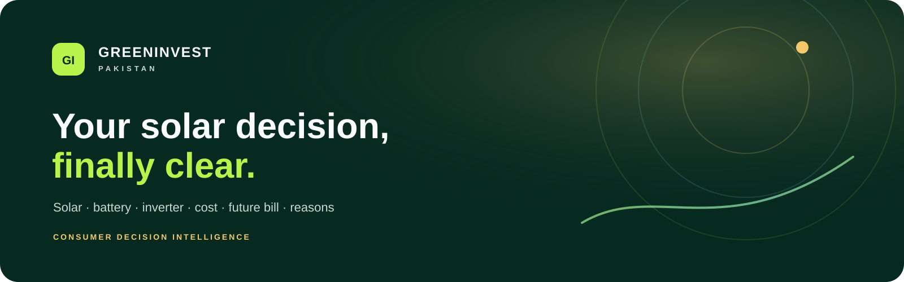
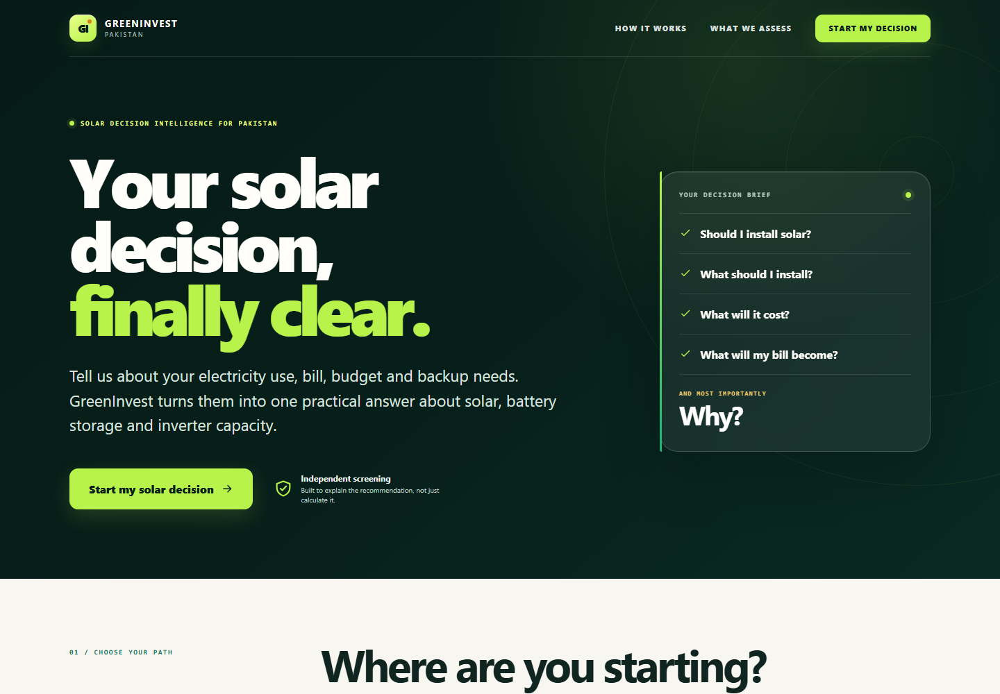
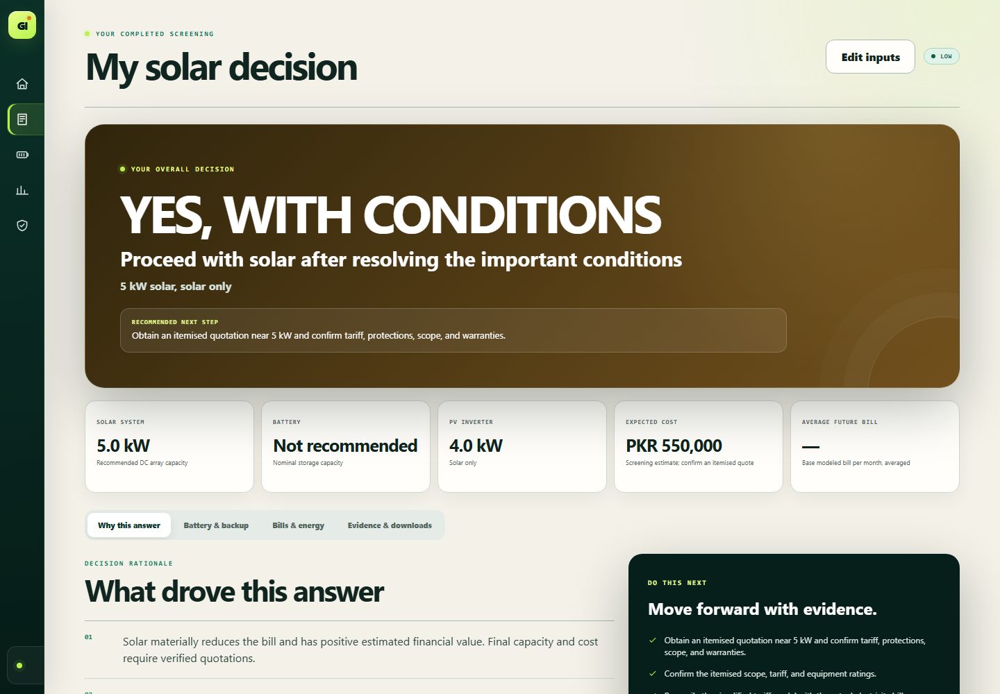
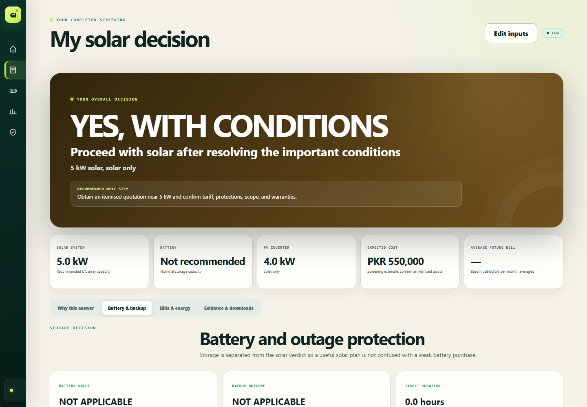
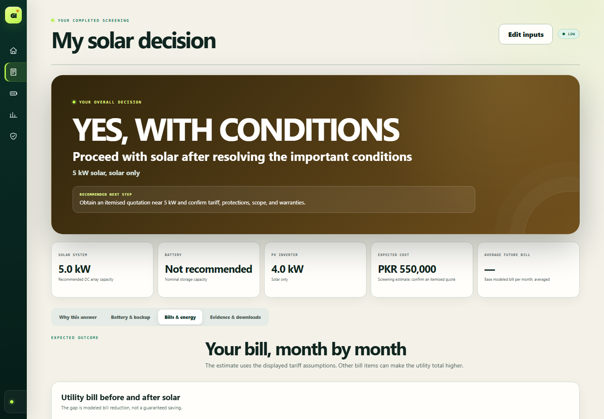
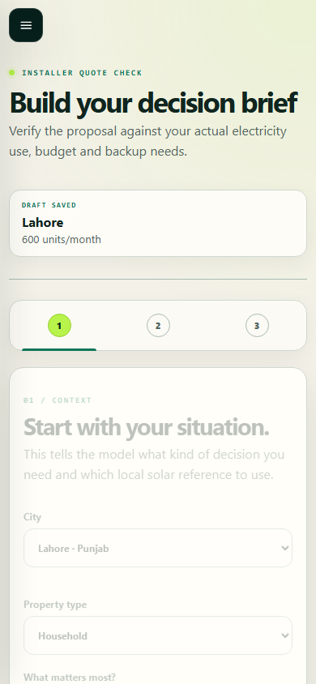

  

<h1 align="center">GreenInvest Pakistan</h1>

<strong>Your electricity data. One clear solar decision.</strong>

  GreenInvest turns electricity use, the current and desired bill, budget,
  roof space and backup needs into a practical recommendation for solar,
  battery storage and inverter capacity.

  <a href="https://greeninvest-pakistan.vercel.app"><strong>Open the live calculator</strong></a>
  &nbsp;&nbsp;·&nbsp;&nbsp;
  <a href="https://github.com/GreenInvest-Pakistan/GreenInvest-Pakistan/releases/latest/download/GreenInvest-Windows-x64.zip"><strong>Download for Windows</strong></a>
  &nbsp;&nbsp;·&nbsp;&nbsp;
  <a href="https://greeninvest-pakistan.vercel.app/impact/"><strong>View project impact</strong></a>

  
  
  
  

---

## A decision brief, not another solar estimate

GreenInvest is designed around the questions people actually need answered
before speaking to an installer or committing capital.

| Your question | What GreenInvest provides |
| --- | --- |
| **Should I install solar?** | An install, conditional or do-not-install screening outcome with the reasons made visible. |
| **What should I install?** | Solar, inverter and battery capacities, plus alternatives worth comparing. |
| **What could it cost?** | A complete screened system estimate checked against the entered budget and roof limits. |
| **What could my bill become?** | Seasonal energy and monthly bill projections, including the bill target and remaining grid charges. |
| **What could change the answer?** | Constraint checks, risks, sensitivity analysis, Monte Carlo uncertainty and evidence requirements. |

  

## Start from where you are

| Build my recommendation | Check an installer quote |
| --- | --- |
| Start with electricity use, bill goals, budget, roof availability and backup needs. | Enter the proposed solar, battery, inverter and price details from a quotation. |
| Receive a screened configuration and alternatives fitted to the stated constraints. | See whether the proposal fits the entered demand, bill target, backup requirement and budget. |
| Best when you are deciding what to request from the market. | Best when you already have a proposal and want a structured second look. |

## What arrives with the recommendation

- **The verdict** — a clear outcome and the decisive reasons behind it.
- **The plan** — selected and alternative solar, inverter and battery sizes.
- **Bills and energy** — seasonal consumption, production and estimated monthly
  grid bills.
- **Battery and backup** — protected-load, outage-duration and storage-capacity
  checks.
- **Risk and uncertainty** — named constraints, sensitivity analysis and
  on-demand Monte Carlo results.
- **Evidence and downloads** — reports, plan data, configuration, evidence and
  CSV exports that can be reviewed outside the application.

  

<strong>See battery, comparison and mobile product views</strong>

 

## Built for Pakistan's real decision context

GreenInvest screens Pakistan consumption slabs and fixed grid charges while
making clear that the final payable bill can also include taxes, fuel and
quarterly adjustments, duties, surcharges, television fees, arrears, minimum
charges and utility-specific items. It models seasonal demand rather than
pretending the same electricity use occurs every month.

The result keeps the assumptions visible so it can support a better installer
conversation—not replace the professional checks that happen before purchase.

## Use it in a browser or on Windows

### Live calculator

Open [greeninvest-pakistan.vercel.app](https://greeninvest-pakistan.vercel.app)
on a phone, tablet or computer. No installation is required.

### Standalone Windows application

1. [Download the latest Windows ZIP](https://github.com/GreenInvest-Pakistan/GreenInvest-Pakistan/releases/latest/download/GreenInvest-Windows-x64.zip).
2. Right-click it and select **Extract All**.
3. Open the extracted folder and run `GreenInvest.exe`.

The package includes the calculation engine, Python 3.13 and Qt WebEngine. It
does not require Python, Node.js, Vercel, a separate browser or a traditional
installer. It supports 64-bit Windows 10 and 11 and uses approximately 400 MiB
after extraction. Calculations continue to work offline.

> **Windows notice:** the current preview is not code-signed, so SmartScreen may
> ask for confirmation on first launch. Download only from the official release
> page and verify the SHA-256 checksum using the [release guide](RELEASES.md).

## Privacy by design

GreenInvest does not ask for a name, email address, electricity account number
or home address to produce a recommendation. The official Windows application
calculates locally. The hosted calculator sends the submitted configuration to
the GreenInvest calculation service only when an analysis is requested.

Minimal anonymous project events may support aggregate impact reporting.
Optional feedback is sent only after permission is selected and the feedback is
submitted. Individual comments never appear on the public impact page.

[Read the privacy summary](PRIVACY.md)

## The professional-verification boundary

GreenInvest is independent screening and decision support. It is not an
installer quotation, final electrical or structural design, financing offer,
warranty, tax calculation or guarantee of savings.

Before spending money, ask qualified local professionals to verify the roof,
shading, structure, wiring, protection, earthing, equipment compatibility,
warranties, utility treatment and complete payable bill.

[Review known limitations](KNOWN-LIMITATIONS.md)

## Release integrity and support

| Resource | Official location |
| --- | --- |
| Current release | [GreenInvest Pakistan 4.3.0](https://github.com/GreenInvest-Pakistan/GreenInvest-Pakistan/releases/latest) |
| Windows verification | [Installation and SHA-256 instructions](RELEASES.md) |
| Product support | [Support guide](SUPPORT.md) |
| Product issue | [Open a structured issue](https://github.com/GreenInvest-Pakistan/GreenInvest-Pakistan/issues/new/choose) |
| Sensitive security report | [Private vulnerability reporting](https://github.com/GreenInvest-Pakistan/GreenInvest-Pakistan/security/advisories/new) |
| Privacy | [Privacy summary](PRIVACY.md) |

Do not attach electricity bills, addresses, account numbers, private
quotations, saved plans, access tokens or other personal information to a
public GitHub issue.

## Product ownership

GreenInvest Pakistan is independently owned. This public repository provides
official documentation and compiled releases; it does not publish the
proprietary calculation model, ranking rules, pricing catalogue, private data
or internal operating tools. Use of the compiled application is governed by
the [GreenInvest Pakistan use and distribution notice](LICENSE.md). Bundled
open-source components retain their respective licences and recipient rights,
documented in [third-party notices](THIRD-PARTY-NOTICES.md).

---

  <strong>GreenInvest Pakistan</strong> 
  Clear solar decisions, with the assumptions left visible.

